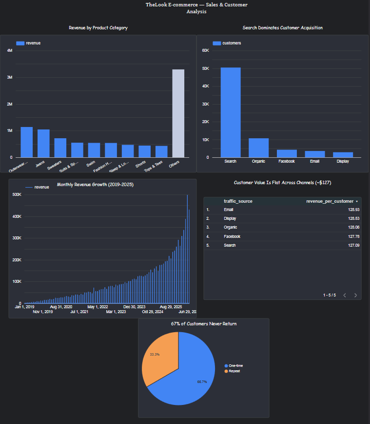

# Dashboard — Looker Studio

🔗 **Live dashboard:** https://datastudio.google.com/reporting/372b78d7-281a-4453-89e0-bd33dfaa3dc8

## Panels

- **Monthly Revenue Growth (2019–2025)** — time series, sustained growth
- **Revenue by Product Category** — bar chart, Outerwear & Jeans lead
- **Search Dominates Customer Acquisition** — customers by channel
- **Customer Value Is Flat Across Channels (~$127)** — revenue-per-customer table
- **67% of Customers Never Return** — one-time vs repeat pie
